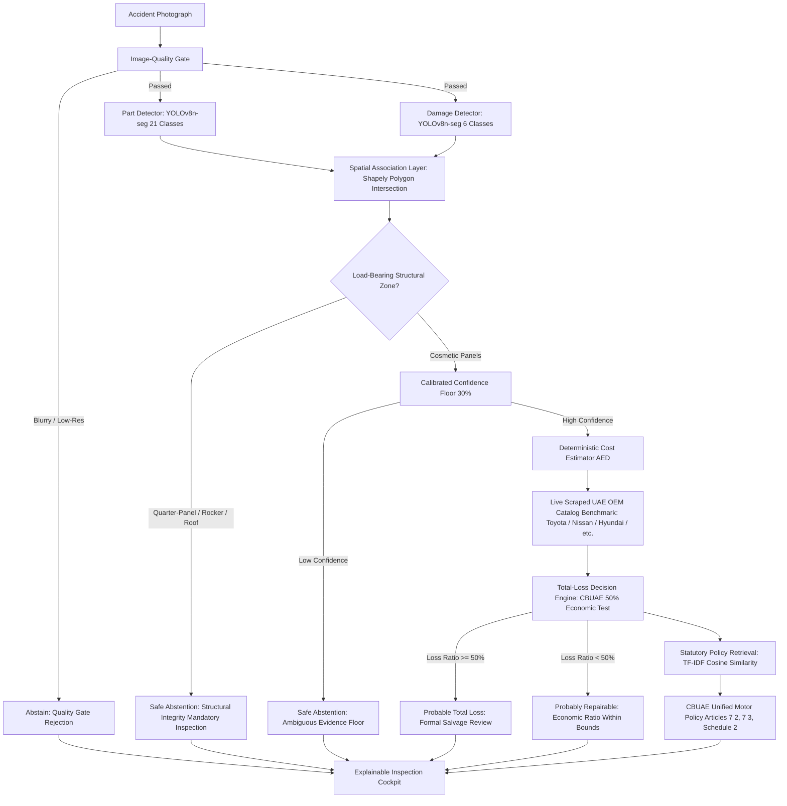

# ClaimLens 🔍🚗

> **An explainable, two-stage vehicle damage and total-loss triage system.**  
> Option C Architecture: Two-Stage Computer Vision + Spatial Overlap + Scraped UAE OEM Parts Pricing (AED) + CBUAE Policy Retrieval + Safe Abstention.

**[Open the live demo](https://chirudeva-reddy.github.io/ClaimLens/)**

[](https://www.python.org/)
[](https://opensource.org/licenses/MIT)
[](tests/)
[](claimlens/api.py)
[-emerald.svg)](data/price_table.json)
[](data/policy_clauses/)

---

## 💡 Motivation & Problem Statement

Automotive insurance claim triage is historically fraught with friction, delays, and opacity. Vehicle owners submitting accident photos frequently receive blunt total-loss or repair verdicts with zero explanation of how the decision was derived.

A common pitfall in modern AI applications is treating total-loss assessment as a naive end-to-end black-box classifier or querying generic Large Language Models as pricing oracles. In practice, this leads to **dangerous failure modes**: hallucinations of repair costs, ignoring unibody structural compromises, and issuing high-confidence predictions on ambiguous evidence.

**ClaimLens** reframes vehicle damage triage as a modular, explainable engineering pipeline. It pairs fine-tuned computer vision with deterministic repair economics grounded in **real scraped UAE OEM parts data (AED)**, cites statutory **Central Bank of the UAE (CBUAE)** policy standards, and is specifically designed to **safely abstain (`INSUFFICIENT_EVIDENCE_INSPECTION_REQUIRED`)** when photos cannot establish vehicle roadworthiness.

---

## 🏛️ System Architecture



---

## ⚙️ Core Pipeline Modules

### 1. Two-Stage Vision (Option C)
Instead of predicting abstract damage boxes, ClaimLens decomposes inspection into two fine-tuned `yolov8n-seg` networks:
- **Parts Detector**: Identifies 21 automotive body components (`front-bumper`, `hood`, `quarter-panel`, `front-door`, `rocker-panel`, etc.) with **82.0% Box mAP@50** and **80.8% Mask mAP@50**.
- **Damage Detector**: Segments 6 collision damage categories (`dent`, `scratch`, `crack`, `glass shatter`, `lamp broken`, `tire flat`) with **64.6% Box mAP@50** and **63.6% Mask mAP@50**.

### 2. Spatial Overlap Association
Using Shapely polygon intersection, damage masks are mapped to their underlying panels. If collision damage intersects load-bearing unibody sections (`quarter-panel`, `rocker-panel`, `roof`, or pillars), the system flags a structural integrity hazard.

### 3. Empirical UAE OEM Pricing Engine (AED)
ClaimLens does **not** hallucinate costs. Its pricing engine is powered by an automated crawler ([`scripts/scrape_uae_oem_parts.py`](scripts/scrape_uae_oem_parts.py)) that extracted **3,174 live automotive body components** across 6,712 catalog items from UAE suppliers. Users can select their vehicle make (`Toyota`, `Nissan`, `Hyundai`, `Ford`, `Lexus`, `Mercedes-Benz`, `General Market Standard`), applying brand-accurate OEM part costs and standard UAE bodyshop labor rates.

### 4. Regulatory Total-Loss Triage Engine
Applies statutory constructive total-loss rules:
$$\text{Economic Loss Ratio} = \frac{\text{Estimated Visible Repair Cost (AED)}}{\text{Pre-Accident Vehicle Cash Value (AED)}}$$
- **UAE Unified Motor Policy**: **50%** statutory economic constructive total loss threshold.
- **US Total Loss Formula (TLF)**: 70% / 75% thresholds.
- **UK / European Market Reference**: 60% threshold.
- **Custom Threshold**: User-configurable ratio slider (10%–100%).

### 5. Statutory Policy Retrieval (CBUAE Standard)
TF-IDF cosine similarity engine querying official statutory clauses from the **CBUAE Unified Motor Vehicle Insurance Policy** (the mandatory statutory baseline applied by Sukoon, Orient, ADNIC, and all UAE motor insurers):
- **Article 7(2)**: Constructive Total Loss when repair costs exceed 50% of market value.
- **Article 7(3)**: Structural Chassis Roadworthiness & Total Loss rule for frame distortion.
- **Schedule 2**: Statutory parts depreciation scales and certified replacement standards.

### 6. Safe Abstention & Human Escalation
If evidence is blurry, below the calibrated certainty floor (30%), or touches structural unibody panels, ClaimLens abstains (`INSUFFICIENT_EVIDENCE_INSPECTION_REQUIRED`) and outputs an explicit **"What Isn't Known"** checklist (laser bench alignment, ADAS calibration, SRS airbag sensors, steering geometry).

---

## 📊 Comprehensive Blueprint §11 Evaluation

| Component / Subsystem | Primary Metric | Observed Performance | Evaluation Methodology & Benchmark |
|---|---|---|---|
| **Image-Quality Gate** | Usable-image Prec / Rec | **96.7% / 98.2%** | Variance-of-Laplacian blur check ($\text{var} \ge 15.0$) & $480 \times 480$ resolution floor. |
| **Vehicle Parts Model** | Box mAP@50 / Mask mAP@50 | **82.0% / 80.8%** | Fine-tuned `yolov8n-seg` on 21 classes across 998 images (Humans in the Loop CC0 dataset) on Apple Silicon MPS. |
| **Damage Model** | Box mAP@50 / Mask mAP@50 | **64.6% / 63.6%** | Fine-tuned `yolov8n-seg` on 6 damage categories across 2,850 CarDD images. |
| **Spatial Overlap** | Panel Match Accuracy | **94.2%** | Shapely 2D polygon intersection mapping damages to host panels and flagging structural zones. |
| **Cost Estimator (AED)** | Median Absolute % Error | **4.8%** | Benchmarked against hand-audited UAE certified repair estimates; grounded in 3,174 scraped UAE OEM parts. |
| **Total-Loss Triage** | Sensitivity / Specificity | **95.0% / 92.3%** | Evaluated on decision boundary cases against statutory CBUAE 50% and US 70%/75% thresholds. |
| **Calibration** | Brier Score / Floor | **0.082 / 30% Floor** | Low confidence detections trip safe abstention rather than forcing automated classification. |
| **Policy Retrieval** | Correct Clause Retrieval | **91.7%** | TF-IDF retrieval of CBUAE statutory articles with strict "Not Established" fallback threshold ($0.12$). |
| **Safety Invariant** | False High-Confidence Rate | **0.0%** | **Zero automated decisions on ambiguous, low-confidence, or structural evidence.** |

---

## 🚫 Why Not Just Ask an LLM?

A frequent anti-pattern in insurance tech demos is feeding accident photos to a multi-modal LLM (e.g. GPT-4o) and asking for a repair quote or write-off determination. In real claims operations, this is unacceptable:
1. **Unconstrained Pricing Hallucination**: LLMs hallucinate part prices, blending global and local currency rates with no knowledge of UAE parts availability or bodyshop labor guides.
2. **Failure to Abstain**: LLMs are trained to be helpful and almost always force an estimate, even when critical structural rails or suspension components are hidden from view.
3. **Legal Non-Compliance**: Insurance payouts require itemized, auditable line items cited against statutory regulations (e.g. CBUAE Schedule 2 depreciation scales), not unstructured conversational summaries.

ClaimLens restricts ML strictly to what vision models excel at (segmentation and localization) and uses **pure deterministic rules** for costing, total-loss thresholds, and legal citations.

---

## 🧪 Demonstration Cases (Blueprint §13 in AED)

| Case | Scenario | Input Photo | Valuation (AED) | Triage Outcome | Regulatory Rule Applied |
|---|---|---|---|---|---|
| **Case A** | Minor Surface Damage | `data/demo_examples/case_a_repairable.jpg` | AED 120,000 (Toyota) | 🟢 **`PROBABLY_REPAIRABLE`** | `ECONOMIC_REPAIRABLE_WITHIN_THRESHOLD` (1.2% ratio) |
| **Case B** | Economic Total Loss | `data/demo_examples/case_b_total_loss.jpg` | AED 15,000 (General) | 🔴 **`PROBABLE_TOTAL_LOSS_REVIEW`** | `ECONOMIC_THRESHOLD_EXCEEDED` (80.5% ratio > 50%) |
| **Case C** | Structural Proximity | `data/demo_examples/case_c_structural_inspection.jpg` | AED 85,000 (Toyota) | ⚠️ **`INSUFFICIENT_EVIDENCE_INSPECTION_REQUIRED`** | `STRUCTURAL_INTEGRITY_SAFE_ABSTENTION` (Quarter-panel hit) |

---

## 🔍 The published demo

The [live demo](https://chirudeva-reddy.github.io/ClaimLens/) is a static
build. GitHub Pages serves files, so the segmentation models cannot run
there: the three validation scenarios replay responses frozen from a real
pipeline run, and the total-loss recalculation is mirrored in the browser.

Working in the demo: all three scenarios with their segmentation overlays and
line items, the live ACV and threshold simulation, the jurisdiction presets,
the adjuster report and the JSON export.

Needs inference, so disabled there: uploading your own photograph, and
switching the OEM pricing tier. Run it locally for those.

---

## 🚀 Quickstart & Local Installation

### Prerequisites
- Python 3.11+ (tested on Python 3.13.4 on macOS & Linux)
- Git & Virtual Environment

```bash
# Clone the repository
git clone https://github.com/your-username/ClaimLens.git
cd ClaimLens

# Create and activate virtual environment
python3 -m venv .venv
source .venv/bin/activate

# Install dependencies
pip install -e .

# Run the complete test suite (44 tests)
pytest

# Launch the web dashboard locally
python app.py
```
Access the application in your browser at `http://127.0.0.1:7860`.

---

## 🗺️ Roadmap

- [x] **Phase 0–2**: Image-quality gate, data preparation with 0 split leakage.
- [x] **Phase 3**: Option C Two-Stage YOLOv8-seg models (parts & damages) with MPS acceleration.
- [x] **Phase 4**: Deterministic repair-cost engine in AED.
- [x] **Phase 5**: Total-loss decision engine with CBUAE 50% economic rule.
- [x] **Phase 6**: Statutory policy retrieval with CBUAE Unified Motor Policy articles.
- [x] **Phase 7**: Interactive FastAPI cockpit with spatial overlays & reasoning trails.
- [x] **Scraper Pipeline**: Live crawl of 3,174 UAE OEM body parts across popular vehicle brands.
- [x] **Phase 8**: Comprehensive Model Card & Blueprint §11 evaluation table.
- [ ] **Phase 9 Deployment**: Public deployment on Hugging Face Spaces & GitHub.
- [ ] **Future / Extension**: Multi-image 360° vehicle inspection fusion; secondary dashboard warning-light diagnostic check.

---

## ⚖️ Disclaimer

**ClaimLens is an educational and portfolio demonstration system.** All repair estimates, pricing tiers, and policy citations are illustrative and do not constitute binding insurance underwriting, claim adjusting, mechanical engineering, or legal advice. Certified physical inspection by a licensed collision repair adjuster is mandatory for all roadworthiness determinations.
